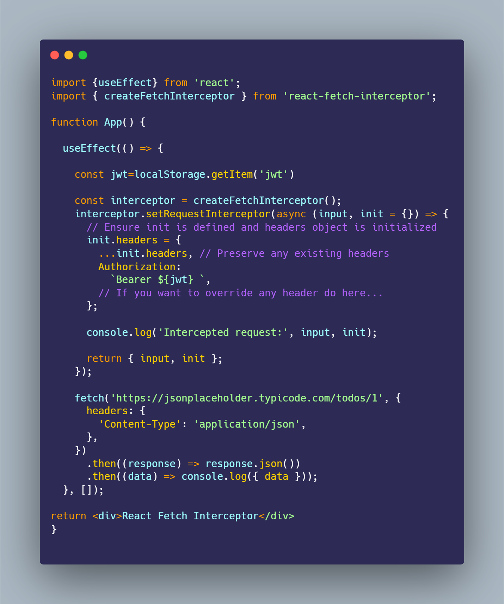

<div align="center">
	<h1> Fetch Interceptor<br>
	<!--  -->
	<!--  -->
	<!--  -->
	</h1>
</div>

> Fetch Interceptor is an npm library that allows you to modify, enhance, and inspect HTTP requests and responses made using the Fetch API. It supports adding headers, handling errors, and chaining multiple interceptors for sophisticated request/response handling.

## Install

```bash
$ npm install --save fetch-interceptor
```

## Usage



## 👨🏻‍💻 AUTHOR

   [Sarim Hassan](https://msarimhassan.vercel.app)
   
